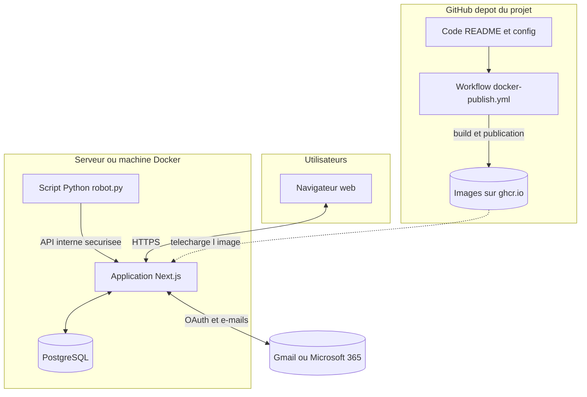

# Exparta Automata Mail — gestion des e-mails entrants

## Résumé

**Exparta Automata Mail** centralise les messages reçus sur vos adresses de réception, vous permet de les traiter manuellement (lecture, transfert, archivage) et d’**automatiser** le tri : filtres réutilisables, chaînes d’actions (transfert, réponse automatique, archivage, etc.), journal d’**historique** et liaison à une **boîte cloud** (Gmail ou Microsoft 365) pour l’envoi et la synchronisation.

Objectif : gagner du temps sur les courriers répétitifs tout en gardant la trace de ce qui s’est passé pour chaque message.

---

## Boîte de réception (`/boite`)

- **Rôle** : liste des messages **non traités** — pas encore transférés avec succès, pas soumis à une action automatique qui les retire de la boîte, non archivés.
- **Ouvrir un message** : cliquez sur une ligne pour lire le contenu, marquer comme lu, répondre ou utiliser les actions du menu.
- **Transfert rapide** : menu du message → choisissez un **raccourci** (adresses définies dans **Réglages**). Exemple : raccourci « Support N2 » vers `support-n2@entreprise.fr`.
- **Archivage manuel** : action d’archivage ; le message rejoint **Traité** et disparaît de la boîte.
- **Astuce** : configurez d’abord au moins un raccourci dans **Réglages** si vous transférez souvent vers les mêmes adresses.

---

## Traité (`/transfere`)

- **Rôle** : messages **déjà traités** — transfert réussi (manuel ou règle), archivage (manuel ou automatique), réponse automatique envoyée, action « ne pas transmettre », etc.
- **Repérer un courrier** : tri par date ; ouvrez le détail comme depuis la boîte.
- **Désarchiver** : lorsqu’un message est uniquement archivé sans autre traitement bloquant, vous pouvez le **remettre en boîte** depuis l’interface pour le retravailler.
- **Note** : une automatisation qui ne fait que modifier le sujet ou préfixer le corps, **sans** transfert / archive / réponse auto / stop, peut laisser le message en réception — c’est voulu pour les scénarios de simple étiquetage texte.

---

## Historique (`/historique`)

- **Rôle** : fil chronologique des événements (réception, transferts, exécution des règles, synchro boîte cloud, erreurs).
- **Filtrer par type** : utilisez les badges de catégorie (réception, transfert, traitement, synchro, rédaction, alerte, erreur).
- **Filtrer par automatisation** : menu déroulant des automatisations pour ne voir que les lignes liées à une règle donnée.
- **Pagination** : en bas de liste, ajustez la taille de page si vous auditez une longue période.
- **Exemple** : pour vérifier pourquoi un message a été archivé hier, choisissez la catégorie **Traitement** et éventuellement l’automatisation concernée.

---

## Filtres (`/filtres`)

- **Rôle** : **motifs réutilisables** (conditions) sans actions ; ils servent de briques pour les automatisations.
- **Créer un filtre** : nom, priorité, adresse de réception ciblée (ou « toutes »), puis une ou plusieurs conditions reliées par **ET** (toutes doivent être vraies).
- **Champs disponibles** :
  - **Expéditeur** — extrait ou adresse e-mail.
  - **Sujet** — champ `Subject`.
  - **Corps** — texte du message.
  - **En-tête MIME** — précisez le nom d’en-tête (ex. `List-Unsubscribe`) puis la valeur à tester.
- **Opérateurs** : contient, est égal à, commence par, expression régulière ; case sensible activable par condition.
- **Exemples** :
  - Sujet **contient** `Facture` → capter les envois de facturation.
  - Expéditeur **contient** `@fournisseur.com` → regrouper un fournisseur.
  - En-tête **contient** avec nom `X-Custom-Id` et valeur attendue pour un flux technique.
- **Activer / désactiver** : un filtre désactivé ne participe plus aux automatisations qui l’emploient.
- **Badge « Filtre »** : peut apparaître lorsque le filtre est lié à une automatisation — repère visuel dans la liste.

---

## Automate (`/automate`)

- **Rôle** : **automatisations** = un ensemble de filtres (logique **ET**) + une **chaîne d’actions** exécutée dans l’ordre lorsque les conditions matchent un nouveau message.
- **Création** : donnez un nom clair, sélectionnez les filtres, puis ajoutez les actions dans l’ordre souhaité.
- **Actions possibles** (selon configuration) :
  - **Modifier le sujet** / **Préfixer le corps** — préparent le message pour les étapes suivantes.
  - **Transférer** — envoi vers une adresse (redirection).
  - **Réponse automatique** — e-mail vers l’expéditeur (texte ou HTML).
  - **Archiver dans l’app** — marque le message comme traité (visible dans **Traité**).
  - **Arrêter / ne pas transmettre** — interrompt la chaîne sans envoi classique.
- **Exemple de chaîne** : préfixer le corps `[Auto] ` → transférer vers `equipe@entreprise.fr` → archiver.
- **Exécution** : un **worker** périodique synchronise la boîte cloud et évalue les règles sur les messages en attente ; sans worker, les nouveaux messages ne seront pas traités automatiquement après réception SMTP.

---

## Réglages (`/reglages`)

- **Raccourcis de transfert** : définissez libellé + e-mail cible ; ils apparaissent dans le menu des messages de la **boîte**. Exemple : libellé « Compta », cible `compta@societe.fr`.
- **Boîte mail cloud** : connectez **Gmail** ou **Microsoft 365** pour que l’application envoie les transferts / réponses auto et importe les messages de votre boîte distante selon votre configuration.
- **Lien direct raccourcis** : l’URL `/reglages?raccourcis=1` ouvre directement la boîte de dialogue de gestion des raccourcis.

---

## Utilisateurs (`/utilisateurs`)

- **Accès** : réservé aux comptes **administrateur**.
- **Usage** : création ou gestion des comptes qui se connectent à l’application (invitation, rôle, etc. selon les écrans disponibles dans votre déploiement).

---

## Documentation (`/documentation`)

- Cette page affiche **ce fichier `README.md`** au format Markdown : toute modification du README à la racine du dépôt est reflétée ici après déploiement ou rechargement en développement.

---

## Architecture technique

*Cette partie est pour celles et ceux qui veulent comprendre « ce qui sous-tend l’outil », sans être développeur·se.*

### En deux phrases

L’application est un **site web moderne** (Next.js) qui parle à une **base de données** (PostgreSQL) pour tout enregistrer : comptes, messages, règles, historique. À côté, un **petit programme Python** peut réveiller l’application à intervalle régulier pour synchroniser la boîte cloud et lancer les automatisations — un peu comme une alarme qui dit « vérifie s’il y a du nouveau courrier à traiter ».

### Schéma : qui parle à qui ?

Le diagramme s’affiche **sur GitHub** (fichier README) et dans l’onglet **Documentation** de l’application. Si un lecteur Markdown ne le dessine pas, utilisez le schéma texte juste en dessous.



**Même idée, sans graphique :**

```text
  [Navigateur]  ←──→  [Application web Next.js]  ←──→  [PostgreSQL]
                              ↑    |
                              |    └──→  [Gmail / Microsoft 365]
                              |
                    [Robot Python sur une machine]
                              |
  [GitHub : code + README] ──→ [Fichier docker-publish.yml] ──→ [Image Docker sur ghcr.io]
                                                                        |
                                                                        └── utilisée pour lancer l’app
```

### GitHub : le « coffre » du projet (ce n’est pas la base des mails)

Le **dépôt GitHub** sert surtout à :

- **Conserver le code source** : toutes les instructions qui font tourner l’application (dossiers `app/`, `components/`, `lib/`, etc.).
- **Tracer les versions** : qui a modifié quoi, quand (historique des changements).
- **Héberger la documentation** : par exemple ce `README.md` à la racine — c’est aussi ce que l’onglet **Documentation** affiche dans l’application.

**Important** : les **e-mails et données d’exploitation** (messages reçus, règles, journaux) ne sont **pas** stockés dans GitHub ; ils vivent dans **PostgreSQL**, sur la machine où vous exécutez l’application (ou votre hébergeur). GitHub garde le *plan de la maison* ; PostgreSQL garde *ce qui se passe dans la maison*.

### Fichier `.github/workflows/docker-publish.yml` : publication automatique d’images Docker

Un **workflow** GitHub Actions est une **recette automatique** lancée sur les serveurs de GitHub lorsque certains événements se produisent.

Ici, le fichier [`.github/workflows/docker-publish.yml`](.github/workflows/docker-publish.yml) :

1. **Se déclenche** lors d’un envoi (`push`) sur la branche `main`, lors de la publication d’une **étiquette de version** du type `v1.0.0`, ou **à la main** (bouton « Run workflow »).
2. **Récupère** une copie fraîche du dépôt.
3. **Construit** une **image Docker** : une sorte de « paquet logiciel » autonome contenant l’application Next.js prête à tourner.
4. **Pousse** cette image vers le **GitHub Container Registry** (`ghcr.io`), sous un nom dérivé de votre organisation et du nom du dépôt (en minuscules, exigence technique du registre).

En pratique : une fois le workflow réussi, vous pouvez lancer l’app avec **Docker** ou **Docker Compose** en pointant vers cette image, sans réinstaller Node à la main sur le serveur — utile pour un déploiement reproductible (voir commentaires en tête de [`docker-compose.yml`](docker-compose.yml)).

### Les technologies principales et leur lien (lexique accessible)

| Élément | Rôle simple | Lien avec le reste |
|--------|-------------|---------------------|
| **Next.js** | Cadre qui sert à la fois les **pages web** et les **routes API** (petits programmes appelés par le navigateur ou par le robot). | Au centre : reçoit les requêtes, parle à la base et aux services mail. |
| **React** | Bibliothèque pour construire l’**interface** (boutons, listes, formulaires) de façon modulaire. | Utilisée *dans* Next.js pour tout ce que vous cliquez à l’écran. |
| **TypeScript** | JavaScript avec des **garde-fous** pour limiter les erreurs avant la mise en production. | Presque tout le code applicatif est écrit ainsi. |
| **Prisma** | **Couche d’accès** à la base de données (lecture / écriture sans écrire du SQL à la main partout). | Traduit les actions de l’app en requêtes vers PostgreSQL. |
| **PostgreSQL** | **Base relationnelle** : tables pour utilisateurs, messages, règles, journaux, etc. | Source de vérité des données métier. |
| **Tailwind CSS** + **composants UI** | **Mise en page** et apparence cohérente (couleurs, espacements). | Habille les écrans React. |
| **Nodemailer / APIs Google & Microsoft** | **Envoi** et **synchronisation** de courriers (SMTP, Gmail, Outlook selon configuration). | Branchées sur Next.js pour transferts, réponses auto, import cloud. |
| **Python (`linker/robot.py`)** | **Automate léger** qui appelle l’API interne de l’app à intervalle régulier (tick worker). | Ne remplace pas l’application : il la **réveille** pour traiter la file d’attente. |
| **Docker** | **Emballage** de l’application et parfois de la base dans des conteneurs reproductibles. | Permet le même déploiement en test et en production ; l’image est produite par le workflow ci-dessus. |

### Résumé visuel pour la mémoire

1. **GitHub** = code + README + **workflow** qui fabrique une **image Docker** publiée sur **ghcr.io**.  
2. **Serveur** = **conteneur web** (Next.js) + **PostgreSQL** + éventuellement le **robot Python**.  
3. **Utilisateur** = navigateur ; **boîtes externes** = Gmail / Microsoft 365 selon vos réglages.
